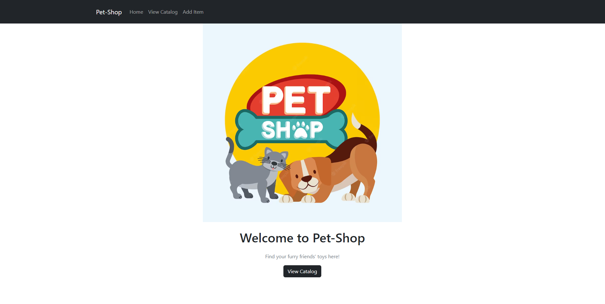
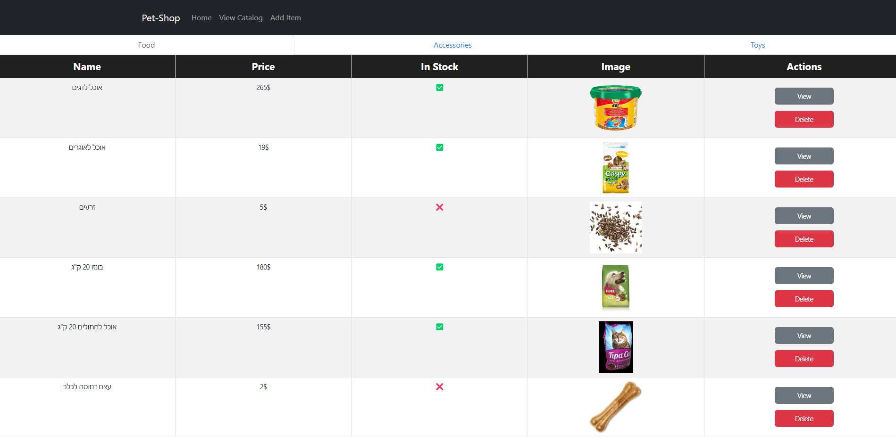
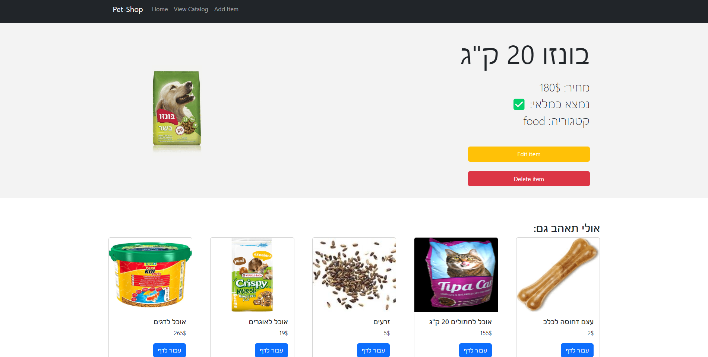
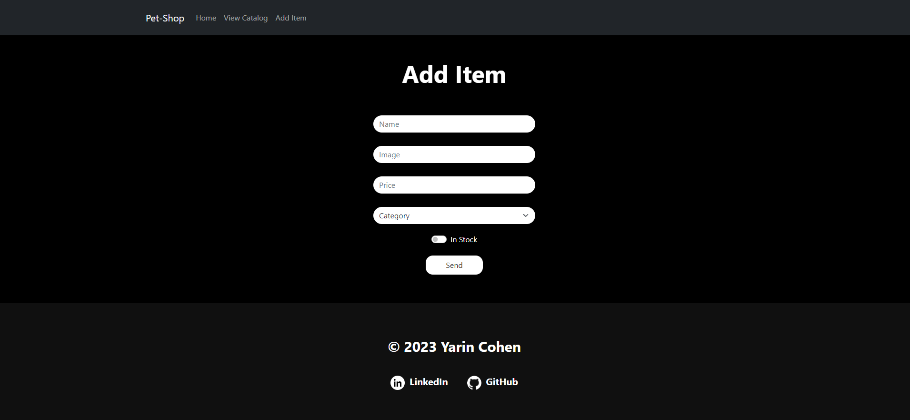

## PET-SHOP
היא חנות המספקת מוצרים לחיות כגון 
אוכל, משחקים ואביזרים

בכל עמוד יוצג לי סרגל עזר לניתוב בין מסכים ותפריט תחתון שיציג לי זכויות יוצרים וקישורים לgithub ו-Linkedin

העמוד הראשי:
 זהו בעצם העמוד הראשון שיוצג למשתמש בעת פתיחת האתר ובתוכו נמצא כותרת, תמונה וכפתור שבעת לחיצה עליו יוצג לי "תפריט" החנות

בעמוד המוצרים נוכל להציג את המוצרים, לערוך ואף למחוק אותם

בנוסף נוכל לראות אם המוצר במלאי, מה מחירו, השם שלו ותמונה

מתחת לכל תיאור ישנם הצעות למוצרים נוספים

דף הוספת מוצר חדש:

